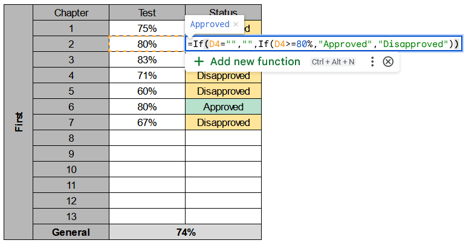

# Tips
Text

# Ghost
**Example**<br>


**Sample Usage**<br>
```python
If(D3="","",If(D3>=80%,"Approved","Disapproved"))
```

**Syntax**<br>
```python
If(value1,value2,If(value3,value4,value5))
```
* **value1:** description <br>
* **value2:** description <br>
* **value3:** description <br>
* **value4:** description <br>
* **value5:** description <br>

**Notes**<br>

**See Also**<br>
